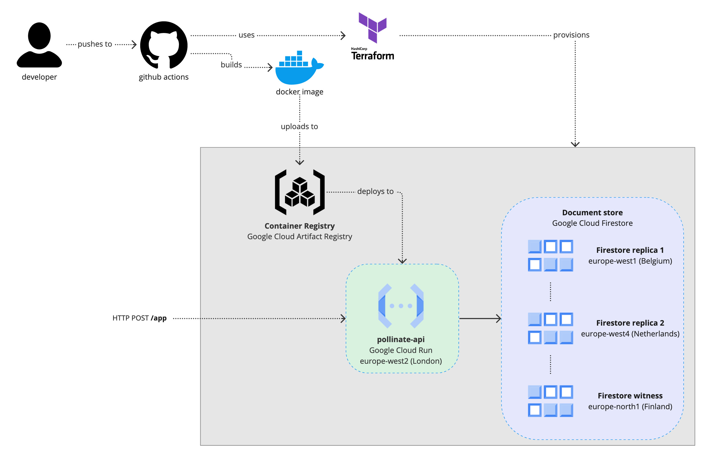

# Dependencies

- [Terraform](https://www.terraform.io/)
- [Terragrunt](https://terragrunt.gruntwork.io/)
- [Python 3.10](https://www.python.org/)
- [Poetry](https://python-poetry.org/)

# Prerequisites

1. Create a new GCP project and enable billing. Note down the project ID (e.g. `pollinate-api-123456`)

# Deploying from local

2. Bootstrap the remote storage for terraform state

```bash
gcloud login
gcloud config set project [PROJECT_NAME]
gcloud storage buckets create gs://pollinate-tfstate
```

3. Run bootstrapping terraform. This creates the container registry for docker images

```bash
cd infra/tg_init
terragrunt apply -var region=[GOOGLE_CLOUD_REGION]
```

4. Authenticate docker cli with container registry

```bash
gcloud auth configure-docker [GOOGLE_CLOUD_REGION]-docker.pkg.dev
```

5. Build and push docker image

```bash
cd api
docker build -t [GOOGLE_CLOUD_REGION]-docker.pkg.dev/[GOOGLE_CLOUD_PROJECT_ID]/pollinate-cr/[IMAGE_NAME]:latest
docker push -t [GOOGLE_CLOUD_REGION]-docker.pkg.dev/[GOOGLE_CLOUD_PROJECT_ID]/pollinate-cr/[IMAGE_NAME]:latest
```

6. Deploy app using terraform

```bash
cd infra/tg_app
terragrunt apply -var region=[GOOGLE_CLOUD_REGION] -var api_image=[GOOGLE_CLOUD_REGION]-docker.pkg.dev/[GOOGLE_CLOUD_PROJECT_ID]/pollinate-cr/[IMAGE_NAME]:latest
```

# High-level design



# Design decisions

I opted to use managed cloud infrastructure (i.e. serverless) to deploy because it is a lot simpler, I get high-availability by default from GCP (all resources are multi-AZ by default, and Firestore is set up to be multi-region)